[![Contributors][contributors-shield]][contributors-url]
[![Forks][forks-shield]][forks-url]
[![Stargazers][stars-shield]][stars-url]
[![Issues][issues-shield]][issues-url]
[![MIT License][license-shield]][license-url]
[![LinkedIn][linkedin-shield]][linkedin-url]

 

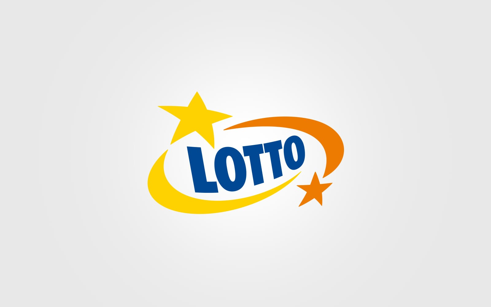

  <h3 align="center">Lotto Analytics</h3>
  
  

    Lotto Analytics is a Python-based project aimed at analyzing lottery data.  
    It provides insights into various lottery games, including Lotto, Lotto Plus, and Mini Lotto. 
    The project utilizes data visualization techniques to present findings such as average winning values, 
    the frequency of wins, and the most common numbers. 
    Users can explore trends year by year and examine popular number combinations.  
     
     
    <a href="https://github.com/DEENUU1/lotto-analytics/issues">Report Bug</a>
    <a href="https://github.com/DEENUU1/lotto-analytics/issues">Request Feature</a>
  

## Results

### Lotto
#### Average winning value depending on the winning type 
##### "Trójka" means that 3 of the numbers drawn are the ones you chose.
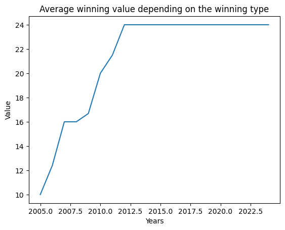

##### "Czwórka" means that 4 of the numbers drawn are the ones you chose.
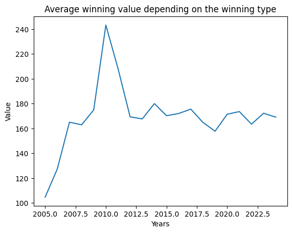

##### "Piątka" means that 5 of the numbers drawn are the ones you chose.
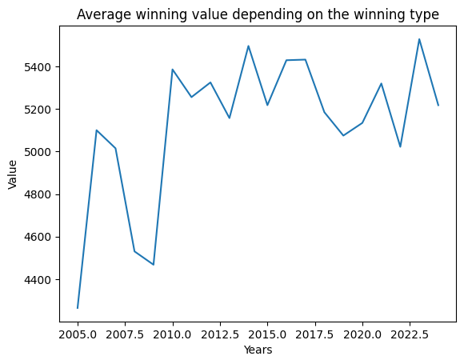

##### "Szóstka" means that 6 of the numbers drawn are the ones you chose.
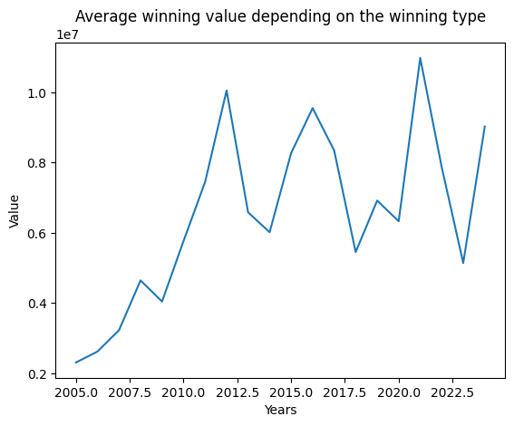

##### "Total" this is the average calculated over all winnings for both "Trójka", "Czwórka", "Piątka", "Szóstka"
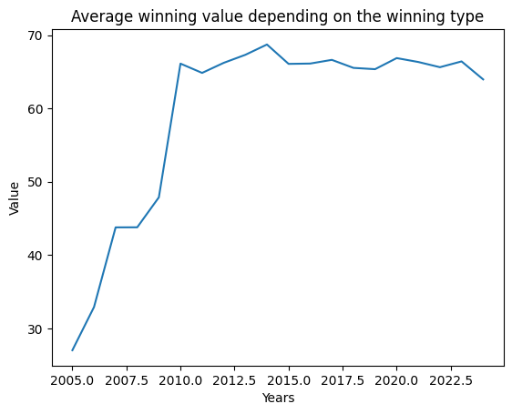

#### Number of wins depending on the winning type year by year
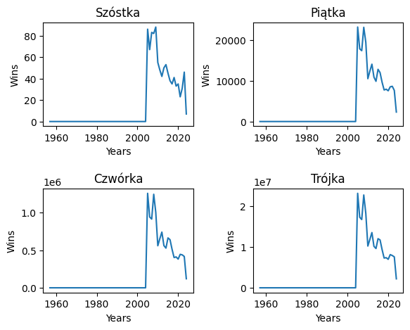

#### Numbers of all wins year by year 
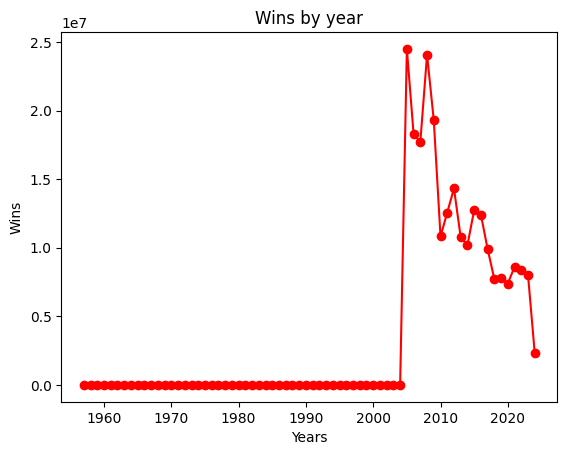

#### Most common numbers 
<table>
<tr>
  <th>Number</th>
  <th>Count</th>
</tr>
<tr>
  <td>7</td>
  <td>811</td>
</tr>
<tr>
  <td>38</td>
  <td>798</td>
</tr>
<tr>
  <td>34</td>
  <td>787</td>
</tr>
<tr>
  <td>24</td>
  <td>782</td>
</tr>
<tr>
  <td>21</td>
  <td>781</td>
</tr>
<tr>
  <td>4</td>
  <td>778</td>
</tr>
</table>

More data are available here:...

#### Most common number by year
In 2024 the most common numbers are:

<table>
<tr>
  <th>Number</th>
  <th>Count</th>
</tr>
<tr>
  <td>27</td>
  <td>7</td>
</tr>
<tr>
  <td>46</td>
  <td>7</td>
</tr>
<tr>
  <td>12</td>
  <td>8</td>
</tr>
<tr>
  <td>26</td>
  <td>8</td>
</tr>
<tr>
  <td>2</td>
  <td>9</td>
</tr>
<tr>
  <td>49</td>
  <td>19</td>
</tr>
</table>

More data are available here:...

#### Most common string numbers
<table>
<tr>
  <th>Numbers</th>
  <th>Count</th>
</tr>
<tr>
  <td>21, 39</td>
  <td>105</td>
</tr>
<tr>
  <td>1, 17</td>
  <td>102</td>
</tr>
<tr>
  <td>46, 7</td>
  <td>101</td>
</tr>
<tr>
  <td>29,9</td>
  <td>101</td>
</tr>
<tr>
  <td>17, 26</td>
  <td>100</td>
</tr>
</table>

More data are available here:...

### Lotto Plus

#### Average winning value depending on the winning type 
##### "Trójka" means that 3 of the numbers drawn are the ones you chose.
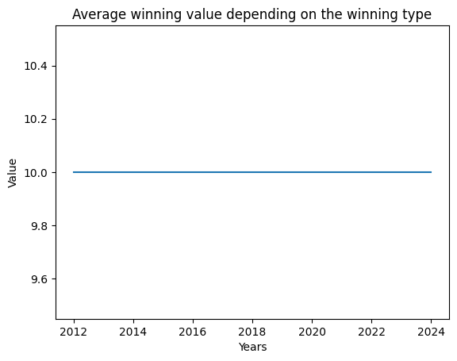

##### "Czwórka" means that 4 of the numbers drawn are the ones you chose.
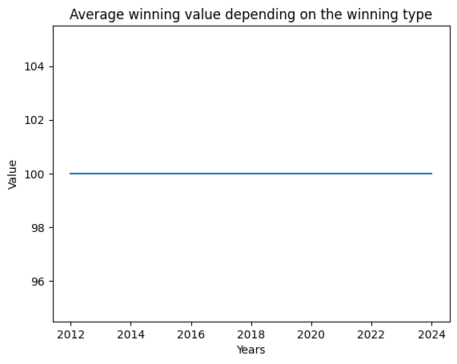

##### "Piątka" means that 5 of the numbers drawn are the ones you chose.
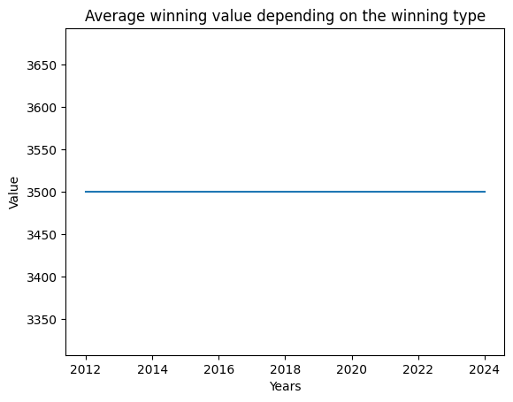

##### "Szóstka" means that 6 of the numbers drawn are the ones you chose.
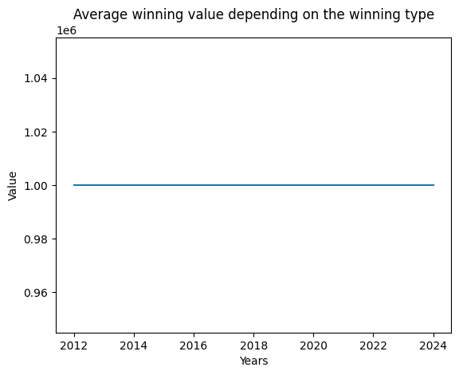

##### "Total" this is the average calculated over all winnings for both "Trójka", "Czwórka", "Piątka", "Szóstka"
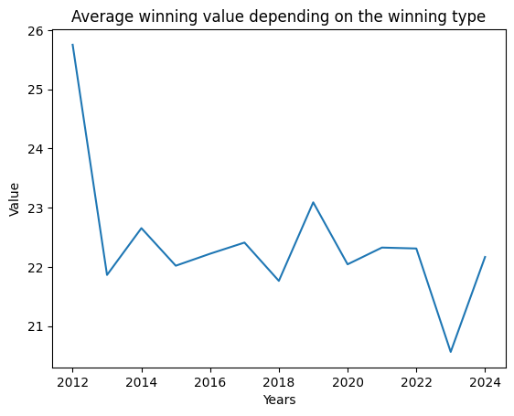

#### Numbers of all wins year by year 
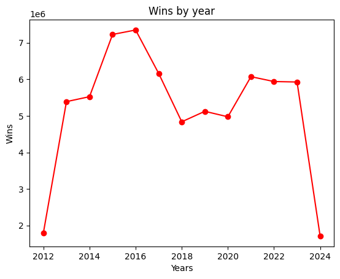

#### Most common numbers 
<table>
<tr>
  <th>Number</th>
  <th>Count</th>
</tr>
<tr>
  <td>44</td>
  <td>256</td>
</tr>
<tr>
  <td>40</td>
  <td>255</td>
</tr>
<tr>
  <td>39</td>
  <td>254</td>
</tr>
<tr>
  <td>8</td>
  <td>244</td>
</tr>
<tr>
  <td>29</td>
  <td>243</td>
</tr>
<tr>
  <td>17</td>
  <td>242</td>
</tr>
</table>

More data are available here:...

#### Most common number by year
In 2024 the most common numbers are:

<table>
<tr>
  <th>Number</th>
  <th>Count</th>
</tr>
<tr>
  <td>35</td>
  <td>7</td>
</tr>
<tr>
  <td>37</td>
  <td>8</td>
</tr>
<tr>
  <td>9</td>
  <td>8</td>
</tr>
<tr>
  <td>8</td>
  <td>8</td>
</tr>
<tr>
  <td>29</td>
  <td>8</td>
</tr>
<tr>
  <td>31</td>
  <td>8</td>
</tr>
</table>

More data are available here:...

#### Most common string numbers
<table>
<tr>
  <th>Numbers</th>
  <th>Count</th>
</tr>
<tr>
  <td>29, 6</td>
  <td>39</td>
</tr>
<tr>
  <td>17, 29</td>
  <td>38</td>
</tr>
<tr>
  <td>38, 40</td>
  <td>38</td>
</tr>
<tr>
  <td>39, 49</td>
  <td>38</td>
</tr>
<tr>
  <td>12, 8</td>
  <td>37</td>
</tr>
</table>

More data are available here:...

### Mini Lotto

#### Average winning value depending on the winning type 
##### "Trójka" means that 3 of the numbers drawn are the ones you chose.
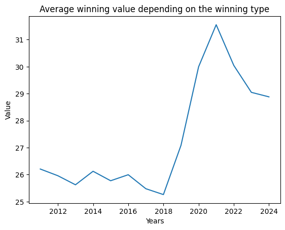

##### "Czwórka" means that 4 of the numbers drawn are the ones you chose.
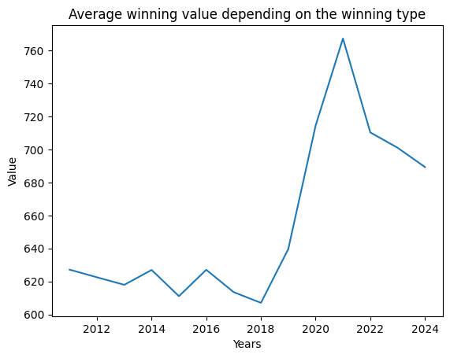

##### "Piątka" means that 5 of the numbers drawn are the ones you chose.
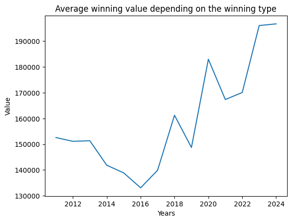

##### "Szóstka" means that 6 of the numbers drawn are the ones you chose.

##### "Total" this is the average calculated over all winnings for both "Trójka", "Czwórka", "Piątka", "Szóstka"
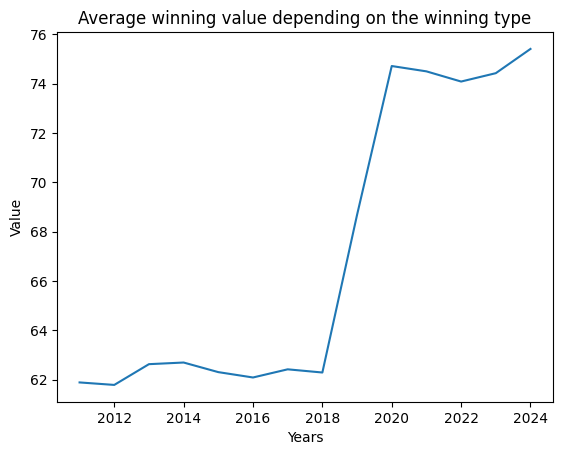

#### Number of wins depending on the winning type year by year
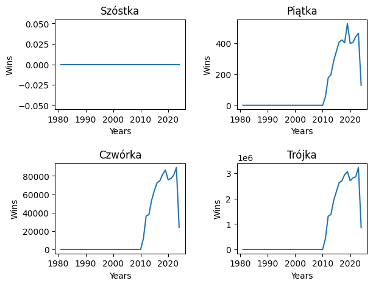

#### Numbers of all wins year by year 
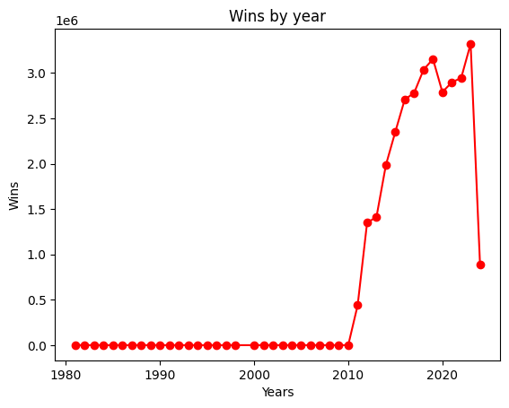

#### Most common numbers 
<table>
<tr>
  <th>Number</th>
  <th>Count</th>
</tr>
<tr>
  <td>36</td>
  <td>816</td>
</tr>
<tr>
  <td>21</td>
  <td>806</td>
</tr>
<tr>
  <td>28</td>
  <td>792</td>
</tr>
<tr>
  <td>7</td>
  <td>791</td>
</tr>
<tr>
  <td>4</td>
  <td>790</td>
</tr>
<tr>
  <td>33</td>
  <td>774</td>
</tr>
</table>

More data are available here:...

#### Most common number by year
In 2024 the most common numbers are:

<table>
<tr>
  <th>Number</th>
  <th>Count</th>
</tr>
<tr>
  <td>26</td>
  <td>15</td>
</tr>
<tr>
  <td>31</td>
  <td>15</td>
</tr>
<tr>
  <td>28</td>
  <td>16</td>
</tr>
<tr>
  <td>18</td>
  <td>18</td>
</tr>
<tr>
  <td>41</td>
  <td>18</td>
</tr>
<tr>
  <td>39</td>
  <td>18</td>
</tr>
</table>

More data are available here:...

#### Most common string numbers
<table>
<tr>
  <th>Numbers</th>
  <th>Count</th>
</tr>
<tr>
  <td>32, 7</td>
  <td>104</td>
</tr>
<tr>
  <td>36, 42</td>
  <td>102</td>
</tr>
<tr>
  <td>2, 3</td>
  <td>101</td>
</tr>
<tr>
  <td>21, 36</td>
  <td>100</td>
</tr>
<tr>
  <td>28, 30</td>
  <td>95</td>
</tr>
</table>

More data are available here:...

## Technologies:
- Python
    - Requests
    - Pandas
    - Matplotlib

## Authors

- [@DEENUU1](https://www.github.com/DEENUU1)

<!-- LICENSE -->

## License

See `LICENSE.txt` for more information.

<!-- MARKDOWN LINKS & IMAGES -->
<!-- https://www.markdownguide.org/basic-syntax/#reference-style-links -->

[contributors-shield]: https://img.shields.io/github/contributors/DEENUU1/lotto-analytics.svg?style=for-the-badge

[contributors-url]: https://github.com/DEENUU1/lotto-analytics/graphs/contributors

[forks-shield]: https://img.shields.io/github/forks/DEENUU1/lotto-analytics.svg?style=for-the-badge

[forks-url]: https://github.com/DEENUU1/lotto-analytics/network/members

[stars-shield]: https://img.shields.io/github/stars/DEENUU1/lotto-analytics.svg?style=for-the-badge

[stars-url]: https://github.com/DEENUU1/lotto-analytics/stargazers

[issues-shield]: https://img.shields.io/github/issues/DEENUU1/lotto-analytics.svg?style=for-the-badge

[issues-url]: https://github.com/DEENUU1/lotto-analytics/issues

[license-shield]: https://img.shields.io/github/license/DEENUU1/lotto-analytics.svg?style=for-the-badge

[license-url]: https://github.com/DEENUU1/lotto-analytics/blob/master/LICENSE.txt

[linkedin-shield]: https://img.shields.io/badge/-LinkedIn-black.svg?style=for-the-badge&logo=linkedin&colorB=555

[linkedin-url]: https://linkedin.com/in/kacper-wlodarczyk

[basic]: https://github.com/DEENUU1/lotto-analytics/blob/main/assets/v1_2/basic.gif?raw=true

[full]: https://github.com/DEENUU1/lotto-analytics/blob/main/assets/v1_2/full.gif?raw=true

[search]: https://github.com/DEENUU1/lotto-analytics/blob/main/assets/v1_2/search.gif?raw=true
